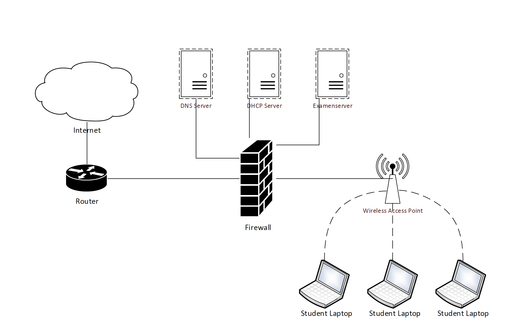

#HSLIDE
## Bachelorproefpresentatie

- Auteur: Benoit Balliu
- Promotor: Bert Van Vreckem

13/06/2019

#HSLIDE
#### Analyse, architectuur en proof-of-concept van een beveiligde omgeving voor het afnemen van computerexamens op eigen laptop

#HSLIDE

### Inhoud

- Huidig systeem om computerexamens af te nemen
- Mogelijke implementaties van BYOD-examens op Hogeschool Gent
- Gekozen implementatie
- Proof-of-concept
- Conclusie
- Toekomstig onderzoek

#HSLIDE

## Huidig systeem om computerexamens af te nemen

#VSLIDE

- Desktop-computers van Hogeschool Gent
- NetSupport School

#VSLIDE

- Functionaliteiten
  - Voordelen
  - Nadelen

#VSLIDE

### Probleemstelling

#HSLIDE

## Mogelijke implementaties van BYOD-examens op Hogeschool Gent

#VSLIDE

## BYOD?
- "bring your own device"
  - Omschrijving
  - Voordelen tegenover het gebruikelijke systeem

#VSLIDE

4 mogelijke implementaties
- Desktop virtualisatie via een cloudprovider
- Beveiligde, configureerbare netwerkomgeving om internettoegang tot niet-toegestane sites vanop laptops tegen te gaan
- Safe Exam Browser
- Televic AssessmentQ / AVIDAnet Lite

#VSLIDE
### Safe Exam Browser.
###  Televic AssessmentQ / AVIDAnet Lite

#VSLIDE
### Desktop virtualisatie via een cloudprovider

#VSLIDE
### Beveiligde, configureerbare netwerkomgeving om internettoegang tot niet-toegestane sites vanop laptops tegen te gaan

#HSLIDE

## Gekozen implementatie

#VSLIDE

#HSLIDE

## Proof-of-concept

#HSLIDE

## Conclusie

#HSLIDE

## Toekomstig onderzoek
