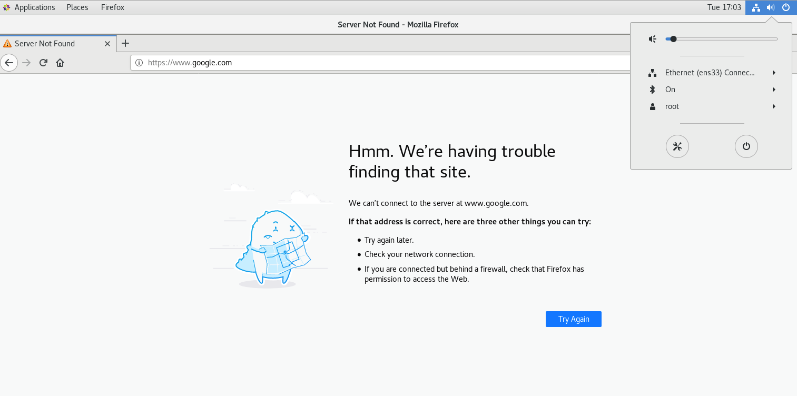

#HSLIDE
## Bachelorproefpresentatie

- Auteur: Benoit Balliu
- Promotor: Bert Van Vreckem

13/06/2019

#HSLIDE
#### Analyse, architectuur en proof-of-concept van een beveiligde omgeving voor het afnemen van computerexamens op eigen laptop


#HSLIDE

### Inhoud

- Huidig systeem om computerexamens af te nemen
- Mogelijke implementaties van BYOD-examens op Hogeschool Gent
- Gekozen implementatie
- Proof-of-concept
- Conclusie
- Toekomstig onderzoek

#HSLIDE

## Huidig systeem om computerexamens af te nemen

#VSLIDE

- Desktop-computers van Hogeschool Gent
- NetSupport School

#VSLIDE

- Functionaliteiten
  - Voordelen
  - Nadelen

#VSLIDE

### Probleemstelling

#HSLIDE

## Mogelijke implementaties van BYOD-examens op Hogeschool Gent

#VSLIDE

## BYOD?
- "bring your own device"
  - Omschrijving
  - Voordelen tegenover het gebruikelijke systeem

#VSLIDE
Vereisten

- Must haves
  - Toegang tot het internet kan verboden worden.
  - Digitale communicatie met medestudenten is niet mogelijk.
  - Snel en makkelijk opzetten van examens.
  - Beperken van toegang tot documenten.

- Should haves
  - Geen.

#VSLIDE
Vereisten (cont.)

- Could haves
  - Beperken van toegang tot software.
  - Monitoring tijdens het examen.
- won’t haves
  - Geen.


#VSLIDE

4 mogelijke implementaties
- Desktop virtualisatie via een cloudprovider
- Beveiligde, configureerbare netwerkomgeving om internettoegang tot niet-toegestane sites vanop laptops tegen te gaan
- Safe Exam Browser
- Televic AssessmentQ / AVIDAnet Lite


#VSLIDE
### Safe Exam Browser
###  Televic AssessmentQ / AVIDAnet Lite

#VSLIDE
### Desktop virtualisatie via een cloudprovider

#VSLIDE
### Beveiligde, configureerbare netwerkomgeving om internettoegang tot niet-toegestane sites vanop laptops tegen te gaan


#HSLIDE

## Gekozen implementatie

#VSLIDE


#VSLIDE
Beveiligde, configureerbare netwerkomgeving om internettoegang tot niet-toegestane sites vanop laptops tegen te gaan


- Functionaliteiten
  - Voordelen
  - Nadelen

#HSLIDE

## Proof-of-concept

#VSLIDE


#VSLIDE
## Voorbereidend werk

#VSLIDE


#VSLIDE


#VSLIDE


#VSLIDE
## Controle

#VSLIDE


#VSLIDE


#VSLIDE
Begin van het examen

#VSLIDE


#VSLIDE


#VSLIDE
Na het examen

#VSLIDE

```
git add --all
git commit -m "Commit message"
git push
```

#VSLIDE

## Nadelen
- Ingewikkeld
- Voldoet niet aan alle vereisten

#HSLIDE

## Conclusie

#VSLIDE

- Niet de optimale oplossing
- BYOD Principe is interessant gebleken

#HSLIDE

## Toekomstig onderzoek

#VSLIDE

Installatie van software
- Meer opties
- Veiliger
- Makkelijker te beheren
